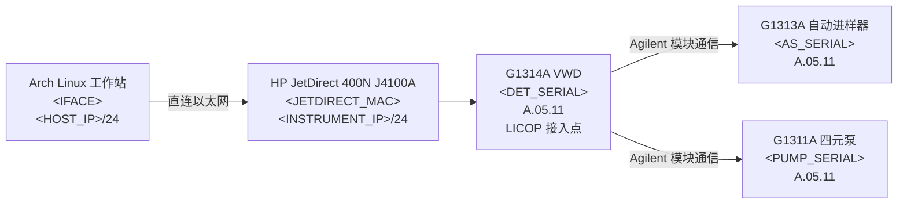
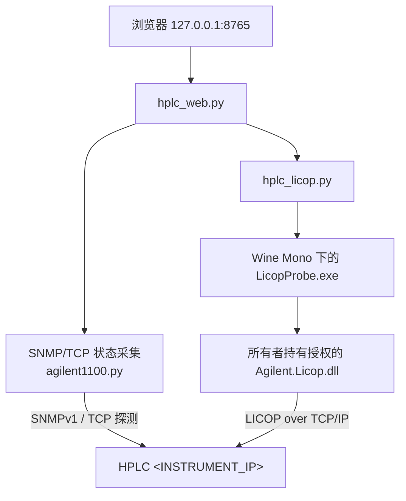

# 在 Arch Linux 上让一台 Agilent 1100 HPLC 重新联网：从 BOOTP 恢复到只读 LICOP 工作台

本文记录一次针对 Agilent 1100 系列 HPLC 的网络恢复与只读状态采集工作：仪器最初没有可用的
IP 地址，最终在没有 ChemStation、没有 OpenLab 的前提下完成了地址恢复、持久化配置、模块清点，
并接入一个自建的 Arch Linux 状态界面。

全文遵循一条工程原则：**在缺少权威协议文档之前，只读不写。** 因此文中对"已知"和"未知"的
区分，比结论本身更重要。

本项目与 Agilent Technologies、Hewlett-Packard 无关，也未获其背书。

> 开源仓库：[github.com/gsioeo/agilent-1100-jetdirect-tools](https://github.com/gsioeo/agilent-1100-jetdirect-tools)
---

## 占位符约定

为便于公开发布，所有可用于定位具体设备的标识都已替换为占位符。文中命令可直接使用，只需把
占位符换成你自己有权操作的设备参数。

| 占位符 | 含义 |
|---|---|
| `<IFACE>` | 工作站上直连仪器的有线网口名 |
| `<HOST_IP>` | 工作站在直连网段上的地址 |
| `<INSTRUMENT_IP>` | JetDirect 卡最终使用的地址 |
| `<DHCP_POOL_START>` | dnsmasq static 模式的范围起点 |
| `<FACTORY_IP>` | 网卡出厂残留配置中请求的地址 |
| `<JETDIRECT_MAC>` | JetDirect 网卡 MAC |
| `<HOST_MAC>` | 工作站网卡 MAC |
| `<JD_HOSTNAME>` | 网卡自带的 `NPI` 前缀主机名 |
| `<HOST_NAME>` | 工作站主机名 |
| `<DET_SERIAL>` / `<AS_SERIAL>` / `<PUMP_SERIAL>` | 检测器 / 自动进样器 / 泵序列号 |
| `<PROJECT_DIR>` | 本地项目目录 |

网络掩码统一为 `255.255.255.0`（`/24`），未做占位。

---

## 技术摘要

仪器的唯一网络出口是安装在检测器模块中的 **HP JetDirect 400N J4100A** 网卡（板号
`J4100-60002`）。它现在使用手工写入并持久保存的 `<INSTRUMENT_IP>/24`，网关
`<HOST_IP>`；工作站直连网口 `<IFACE>` 使用 `<HOST_IP>/24`。

通过 Agilent 官方 LICOP 开发者库，最终确认三个模块：

| 功能 | 型号 | 序列号 | 模块固件 |
|---|---|---|---|
| 可变波长检测器，兼 LAN 接入点 | G1314A | `<DET_SERIAL>` | A.05.11 |
| 标准自动进样器 | G1313A | `<AS_SERIAL>` | A.05.11 |
| 四元泵 | G1311A | `<PUMP_SERIAL>` | A.05.11 |

G1314A 返回灯类型 `LTYP 1`，文档中对应 VWD 灯硬件类型。**这不能说明灯当前是否点亮。**
LICOP 未通告独立的从设备阀模块；G1311A 内部的多通道梯度阀（MCGV）物理上存在，但其当前位置
无法读取。

只读状态由两层构成：

- SNMP 层报告 JetDirect 网卡与网络健康，以及一条聚合外设消息，当前值为 `ready to run`。
- 官方 Agilent LICOP .NET 库报告真实模块清单、逻辑通道、固件标识与原始事件快照。

本项目明确**不**声称获得了泵压力/流量、阀位置、进样器位置、灯开关或真实运行状态。所提供的
LICOP SDK 只文档化了传输 API，不包含解释这些量所需的模块指令与事件码字典。整个过程未发送
任何改变仪器状态的命令。

---

## 交付物

项目位于 `<PROJECT_DIR>`，纯标准库实现：

| 组件 | 作用 |
|---|---|
| `agilent1100.py` | SNMPv1 编解码、JetDirect 状态采集、TCP 探测、MIB 遍历、受限原始帧交换 |
| `hplc_status.py` | 单次输出人类可读或 JSON 格式的网络/JetDirect 状态 |
| `hplc_watch.py` | 持续只读监控，可选 JSON Lines 输出 |
| `hplc_mib_walk.py` | 对相关 HP 企业 MIB 子树做只读遍历 |
| `hplc_control.py` | 仅连接探测、SCPI 否定测试、受锁定的专家级原始帧传输 |
| `hplc_licop.py` | 在 Wine Mono 下构建并调用官方托管 LICOP 库的 Python 封装 |
| `licop_bridge/LicopProbe.cs` | 使用已文档化 `Agilent.Licop` API 的 C# 桥接器 |
| `hplc_web.py` | 仅绑定 loopback 的浏览器工作台，提供 `/api/status` 与带缓存的 `/api/licop` |
| `PROTOCOL_FINDINGS.md` | 协议证据、已验证指令、限制与兼容性说明 |
| `tests/` | 九个本地测试，覆盖 SNMP 编码、安全边界、LICOP 前置条件与仪表板集成 |

---

## 证据分级：本文中"已知"的定义

面对专有实验室设备，把结论分级比给出结论更重要：

| 标签 | 含义 |
|---|---|
| **已验证** | 由实机通过已文档化接口返回，或由观察到的网络事务直接呈现 |
| **有文档** | Agilent/HP 文档或所提供 SDK 中有陈述，但未必在本机验证过 |
| **推断** | 多项观察强烈支持，但没有任何字段直接报告该事实 |
| **未知** | 不存在可用的权威命令、字段或解码表 |

其中最关键的一条：JetDirect 的聚合消息 `ready to run` **不构成**泵在输液、进样器已归位、
检测器灯已点亮或系统可以开始分析运行的证据。

---

## 最终系统拓扑



软件路径按层划分，以避免把"网卡的状态"误当成"仪器的状态"：



---

## 阶段一：在一根直连网线上找到仪器

### 链路先于地址存在

工作站上相关接口的初始状态：

```text
lo               UNKNOWN
<IFACE>          DOWN/UP（取决于网线状态）
wlan0            UP
singbox_tun      UNKNOWN
```

正确的有线接口是 `<IFACE>`，主机 MAC 为 `<HOST_MAC>`。

主机最初被配置在一个错误的实验网段上：

```bash
sudo ip addr add 192.0.2.1/24 dev <IFACE>
```

抓包显示 JetDirect 期望的是另一个网段，因此直连地址最终改为：

```bash
sudo ip addr replace <HOST_IP>/24 dev <IFACE>
```

此处用 `replace` 而非重复 `add` 是有意的：前者幂等，不会在接口上堆积重复地址。

### 抓 BOOTP 广播识别无标签网卡

网卡外部没有可用标签，MAC 地址从广播流量中恢复：

```bash
sudo tcpdump -ni <IFACE> -e -vv 'udp port 67 or 68'
```

抓包中出现两个客户端，必须区分开：

| MAC | 身份 | 证据 |
|---|---|---|
| `<HOST_MAC>` | 工作站网卡 | 主机自身发出的 DHCP 帧，主机名 `<HOST_NAME>` |
| `<JETDIRECT_MAC>` | HP JetDirect / HPLC | 供应商类别 `Hewlett-Packard JetDirect`，主机名 `<JD_HOSTNAME>` |

这一区分是必要的：主机在自己的 DHCP 尝试中恰好也请求过 `<INSTRUMENT_IP>`。仪器随后以一个更大
的广播帧出现，来自 `<JETDIRECT_MAC>`，最初请求 `<FACTORY_IP>`，并通告：

```text
Hostname: <JD_HOSTNAME>
Vendor-Class: Hewlett-Packard JetDirect
Requested-IP: <FACTORY_IP>
```

`NPI` 后缀对应 JetDirect MAC 的末三字节，是 HP 的常见主机名约定——这为"抓到的就是目标网卡"
提供了第二重独立佐证。

---

## 阶段二：用 dnsmasq 下发地址

### 为什么用 dnsmasq 充当 BOOTP 组件

J4100A 在缺少可用存储配置时会持续广播 BOOTP/DHCP 请求。`dnsmasq` 可以在不安装 Agilent 的
Windows BOOTP 工具的前提下应答这些请求。

Arch 上安装：

```bash
sudo pacman -S dnsmasq
sudo pacman -S tcpdump
```

`dnsmasq 2.93` 以前台方式运行，仅绑定直连仪器的接口，并关闭 DNS 功能。

### 第一次的 dhcp-range 语法是错的

以下写法被拒绝：

```text
--dhcp-range=<DHCP_POOL_START>,<某个结束地址>,static,255.255.255.0,12h
```

报错：

```text
dnsmasq: bad command line options: bad dhcp-range
```

在这里使用的 static-only 模式下，`static` 必须位于第二个位置。被接受的命令是：

```bash
sudo dnsmasq --no-daemon --interface=<IFACE> --bind-interfaces \
  --port=0 --no-resolv --no-hosts --log-dhcp --dhcp-broadcast \
  --dhcp-range=<DHCP_POOL_START>,static,255.255.255.0,12h \
  --dhcp-host=<JETDIRECT_MAC>,<INSTRUMENT_IP>,agilent-1100,infinite \
  --dhcp-option=3,<HOST_IP>
```

第二个故障是 `unknown interface <IFACE>`，发生在接口尚无可用 IPv4 配置时。用
`ip addr replace` 重新写入 `<HOST_IP>/24` 后，接口进入 `dnsmasq` 期望的状态。

### 成功的 BOOTP 交换

决定性的日志序列：

```text
DHCPDISCOVER(<IFACE>) <FACTORY_IP> <JETDIRECT_MAC>
DHCPOFFER(<IFACE>) <INSTRUMENT_IP> <JETDIRECT_MAC>
DHCPREQUEST(<IFACE>) <INSTRUMENT_IP> <JETDIRECT_MAC>
DHCPACK(<IFACE>) <INSTRUMENT_IP> <JETDIRECT_MAC> agilent-1100
```

下发的租约内容：

| 参数 | 值 |
|---|---|
| 地址 | `<INSTRUMENT_IP>` |
| 掩码 | `255.255.255.0` |
| 路由器 | `<HOST_IP>` |
| 主机名 | `agilent-1100` |
| 租期 | 对指定 MAC 为无限期 |

完整的 OFFER/ACK 序列同时证明了二层可达性与设备身份识别正确——两者都在任何 HPLC 协议工作
开始之前完成。

---

## 阶段三：让 J4100A 的地址持久化

### 这块卡不是 G1369A

硬件确认为 **HP JetDirect 400N J4100A**，板号 `J4100-60002`。卡上有三个链路跳线：

- `10/100`
- `Full/Half`
- `Man/Auto`

它们控制以太网速率、双工与自动协商，**不是** BOOTP 或 IP 存储开关。因此，针对更晚期的 Agilent
G1369A 的 `Bootp & Store` / `Using Stored` 开关模式的建议对本卡不适用。这是一个容易造成误操作
的型号混淆点。

由于观察到的链路稳定，跳线未做改动。SNMP 随后报告工作速率为 **10 Mbps**。

### Telnet 自带帮助优于猜命令

Arch 上初始没有 telnet 客户端：

```text
fish: Unknown command: telnet
```

安装 `inetutils` 后可用：

```bash
sudo pacman -S inetutils
telnet <INSTRUMENT_IP>
```

出现 JetDirect 横幅：

```text
HP JetDirect

Please type "?" for HELP, or "/" for current settings
>
```

来自较新 JetDirect 文档的多种命令形式全部被拒绝：

```text
ip-config manual
ipconfig: MANUAL
ipconfig:MANUAL
```

三者均返回 `Illegal Entry`。正确答案来自这块卡自己的 `?` 输出：该固件提供的是 `dhcp-config`，
而不是 `ip-config`。

成功的配置序列：

```text
dhcp-config:0
ip:<INSTRUMENT_IP>
subnet-mask:255.255.255.0
default-gw:<HOST_IP>
quit
```

`quit` 保存并回显已提交的配置：

```text
IP Address      : <INSTRUMENT_IP>
Subnet Mask     : 255.255.255.0
Default Gateway : <HOST_IP>
Idle Timeout    : 90 Seconds
Host Name       : agilent-1100
DHCP Config     : Disabled
Passwd          : Disabled
Other Protocols : Enabled
Banner page     : Enabled
```

**教训：管理老旧嵌入式设备时，应优先相信设备内置的命令帮助，而不是相近型号的手册。**

### 配置生效后的短暂失联

Telnet 修改之前，四次 ping 全部成功：

```text
4 transmitted, 4 received, 0% packet loss
rtt min/avg/max/mdev = 1.233/1.688/2.708/0.594 ms
```

写入持久网络配置后，一次测试显示 `100% packet loss` 并伴有本地
`Destination Host Unreachable`。约两分钟后同一测试恢复：

```text
4 transmitted, 4 received, 0% packet loss
rtt min/avg/max/mdev = 1.203/1.658/2.702/0.606 ms
```

现有证据只能确认存在一次短暂的重配置中断，不能确定其内部原因。可能的因素包括 JetDirect 接口
重启与 ARP 状态收敛。真正重要的结论是：在停止 BOOTP 服务的情况下，地址仍然自行恢复，说明配置
确实被写入了非易失存储。

---

## 阶段四：刻画 JetDirect 端点

### 网络身份

只读 SNMP 与 HTTP 检查得到的网卡画像：

| 字段 | 已验证值 |
|---|---|
| 型号 | J4100A |
| 主机名 | `agilent-1100` |
| MAC | `<JETDIRECT_MAC>` |
| IPv4 | `<INSTRUMENT_IP>/24` |
| 主机侧直连接口 | `<IFACE>`，`<HOST_IP>/24` |
| 链路 | up，10 Mbps |
| SNMP 卡状态 | `4`，映射为在线 |
| 聚合外设文本 | `ready to run` |
| 外设致命错误 | `0` |
| 网卡致命错误 | `0` |
| 检查时的数据客户端 | 空闲，`0.0.0.0:0` |
| HTTP 页面标题 | `Hewlett Packard` |

固件字符串暴露了两个不同的组件：

```text
SNMP description: ROM K.08.08, EEPROM K.08.20
LICOP LinkInfo:   Firmware Rev. K.08.20
```

这两个值应分别保留，不应合并为单一的"固件"字段。工作台快照显示的是 `ROM K.08.08`，而 LICOP
链路元数据报告 `K.08.20`。

Agilent 较晚期的 OpenLab 支持矩阵把 `K.08.32` 列为 J4100A 的最低受支持版本，当前网卡低于该
支持下限。尽管所有者提供的 LICOP 库确实连接成功，运行上的成功并不消除兼容性风险。

### 暴露的服务

观察到的 TCP 端口：

| 端口 | 可能的服务 | 安全/运行说明 |
|---|---|---|
| 21 | FTP 管理 | 明文遗留服务 |
| 23 | Telnet 管理 | 明文；本次用于写入静态地址 |
| 53 | JetDirect DNS 相关服务 | 遗留嵌入式服务面 |
| 80 | HTTP 管理 | 仅 HTTP，未观察到 HTTPS |
| 515 | LPD | 打印机时代的 JetDirect 服务 |
| 631 | IPP | 打印机时代的 JetDirect 服务 |
| 9100 | Raw JetDirect / Agilent LICOP 传输 | 可建立连接，但不是 SCPI |

SNMPv1 同时在 UDP 161 上响应，社区名为 `public`。

这是一套 1990 年代末至 2000 年代初的管理面：FTP、Telnet、HTTP 与 SNMPv1 全部未加密。最安全
的部署方式是专用隔离仪器网络，而不是可路由的企业网或面向互联网的网段。

---

## 阶段五：SNMP 能给出什么，不能给出什么

### 有效的 JetDirect 状态

自建 SNMP 客户端读取标准 MIB-II 字段以及 HP JETDIRECT3-MIB 对象，其中较重要的 OID：

| 含义 | OID |
|---|---|
| JetDirect 状态 | `1.3.6.1.4.1.11.2.4.3.1.1.0` |
| 聚合仪器状态 | `1.3.6.1.4.1.11.2.4.3.1.2.0` |
| 外设致命错误 | `1.3.6.1.4.1.11.2.4.3.1.3.0` |
| 网卡致命错误 | `1.3.6.1.4.1.11.2.4.3.1.4.0` |
| JetDirect 型号 | `1.3.6.1.4.1.11.2.4.3.1.10.0` |
| 数据连接状态 | `1.3.6.1.4.1.11.2.4.3.4.10.0` |
| 已连接客户端地址 | `1.3.6.1.4.1.11.2.4.3.4.11.0` |
| 已连接客户端端口 | `1.3.6.1.4.1.11.2.4.3.4.12.0` |

这一层适合做可达性、网卡健康、链路状态、运行时间、数据通道占用与致命错误监控。

### 完整供应商 MIB 遍历：有价值的否定结果

使用 SNMPv1 GET-NEXT 遍历了三个供应商分支：

| 子树 | 结果 |
|---|---|
| HP netPML `1.3.6.1.4.1.11.2.3.9.4` | 无暴露对象 |
| JETDIRECT3 system `1.3.6.1.4.1.11.2.4.3.1` | 聚合外设/网卡状态与状态页数据 |
| MIO/NPI `1.3.6.1.4.1.11.2.4.3.8` | 接口技术字段，无 LC 模块遥测 |

遍历未发现任何与压力、流量、溶剂配比、阀、样品瓶、进样针、灯或运行状态相关的 OID。这一否定
结果的价值在于：它终止了继续在 SNMP 上试探的路线，把工作导向 LICOP，而不是让人反复怀疑"是否
还有某个没猜到的 OID"。

---

## 阶段六：证明端口 9100 不是普通 SCPI

JetDirect raw 端口接受 TCP 连接。常规 SCPI 身份查询被测试了两次：

```text
Payload:  *IDN?\n
Hex:      2a 49 44 4e 3f 0a
Response: none
```

两次尝试都记录在 `control_audit.jsonl` 中。无响应并不意味着仪器故障，它说明 raw TCP 9100
不是面向行的常规 SCPI 接口。

一条早期命令行示例还暴露了工具设计问题：

```bash
./hplc_control.py <INSTRUMENT_IP> raw --hex "VERIFIED AGILENT FRAME"
```

该命令失败，因为 `--hex` 接受的是实际的十六进制字节对，而非描述性文字。文档随后改为使用明确
的惰性格式示例（例如 `de ad be ef`），并默认执行 dry-run。

原始帧发送器现在要求同时满足以下全部条件才会真正发送：

- 参数是真实的十六进制字节对；
- 显式 `--execute`；
- 精确的风险确认串 `I-VERIFIED-THE-AGILENT-COMMAND`；
- 载荷不超过 4096 字节；
- 单次发送，不自动重试。

该通道是专家逃生口，不是受认可的 HPLC 控制器。

---

## 阶段七：区分"已文档化的指令名"与"可上线的字节帧"

公开资料确认了若干指令名称，但没有给出把它们直接放到 TCP 9100 上所需的完整字节封装。

| 指令/事件 | 实际被文档化的内容 |
|---|---|
| `IDN?`、`TYPE?`、`~BID?` | 通过 Agilent 指令窗口进行的只读模块/板卡查询 |
| `RA`、`RE` | 指令被接受 / 无效指令的应答前缀 |
| `OPEN_SOCKETS`、`OPEN_SOCKETS_EX` | LICOP 套接字管理指令名 |
| `CPTM` | check-post-time 指令 |
| `STRT`、`ABRT` | 真实的状态改变类指令名 |
| `ES 0129`、`ES 0128` | 较新固件中的 ready-for-start / not-ready-for-start 事件 |
| `RAWD:SIGSTOR:SET`、`RAWD:SIG:SET` | 经 LICOP 指令通道使用的检测器原始数据订阅 |

公开资料缺失的部分包括：会话建立、逻辑通道封帧、模块寻址、序列字段、长度字段与校验和。因此，
把 ASCII 字符 `STRT` 发到端口 9100 并不构成一个已验证的 LICOP 命令帧。

Agilent 固件说明中还有一条具体的安全警告：`STRT` 之后紧接 `ABRT` 可能使部分模块固件停留在
`WAITY_CONTR` 状态。这两条指令在本工作台中均未启用。

---

## 阶段八：接入官方 LICOP 开发者库

### 所有者提供的软件包

仪器所有者接受 Agilent 的条款后，自行下载了：

```text
vendor/licop/Licop Library A.01.00 [024]
vendor/licop/Licop Server A.03.01 [004]
```

第一个目录包含：

- `Agilent.Licop.dll`，32 位托管 .NET 程序集；
- `Agilent.Licop.xml`，XML API 文档；
- 一个 C# 控制台演示程序。

第二个目录是较旧的 `Licop.exe` COM 服务器、一份 PDF API 手册与 VB/C#/C++ 示例。本项目使用托管
库，不注册 COM 服务器。该 DLL 属于所有者授权范围，未纳入公开仓库。

### 已文档化的托管 API 流程

所提供的演示程序确立了受支持的连接模型：

1. 用设备/控制器超时构造 `Instrument`；
2. 以仪器 IP 调用 `TryConnect` 或 `Connect`；
3. 读取接入点标识与模块标识；
4. 创建 `Module` 对象；
5. 枚举并创建逻辑 `Channel` 对象；
6. 以轮询或事件模式打开通道；
7. 关闭通道并正常断开。

本机上观察到的相关通道类型：

| 通道 | 观察到的格式/方向 | 本项目中的使用 |
|---|---|---|
| `IN` | ASCII，可读可写 | 仅发送硬编码的已文档化查询 |
| `EV` | ASCII，只读 | 被动事件快照 |
| `MO` | ASCII，只读 | 被动监控窗口；未观察到消息 |
| `LI` | ASCII，只读 | 仅枚举，未打开 |
| `DI` | ASCII，只读 | 仅枚举，未打开 |
| `RD` | 二进制，只读 | 仅枚举，未打开 |
| `PR`、`LD` | 二进制，只写 | 从未打开 |
| `TR` | ASCII，读写 | 从未打开 |
| `CI`、`CO` | G1314A 的附加通道 | 仅枚举，未打开 |

### 在 Arch 上运行 .NET 2.0 时代的代码

该库面向 Microsoft .NET Framework 2.0。工作站已安装 Wine 与 Wine Mono，其中包含 C# 编译器，
路径形如：

```text
/usr/share/wine/mono/wine-mono-<版本>/lib/mono/4.5/csc.exe
```

`hplc_licop.py` 的流程是：在 `/tmp` 下创建私有 Wine prefix，编译 `LicopProbe.cs`，把授权 DLL
放到可执行文件旁以便程序集解析，运行探针并解析其 JSON 输出。

第一次沙箱内尝试失败，原因是 Wine 的本地 wineserver 套接字被阻断。把这个作用范围很窄的桥接器
放到沙箱外运行后编译成功。随后对 localhost 做否定测试，得到结构化的
`Agilent.Licop.ConnectException`——这在接触实机之前就证明了 DLL 已正确加载且错误处理有效。

---

## 阶段九：已验证的 LICOP 清单与只读应答

### 模块发现

LICOP 返回的接入点为检测器：

```text
G1314A:<DET_SERIAL>
```

完整清单：

| 标识 | 角色 | 接入点 | 从设备 |
|---|---|---|---|
| `G1314A:<DET_SERIAL>` | VWD 检测器 | 是 | 否 |
| `G1313A:<AS_SERIAL>` | 自动进样器 | 否 | 否 |
| `G1311A:<PUMP_SERIAL>` | 四元泵 | 否 | 否 |

`HasSlaves` 为 false。其准确含义是 LICOP 未通告独立的 CAN 从设备阀，而不是四元泵不含内部梯度阀。

### 硬编码查询白名单

桥接器不接受调用方提供的任何 LICOP 指令。使用 `--identity` 时，它打开 `IN` 并且只发送：

- 对每个模块发送 `IDN?`；
- 对每个模块发送 `TYPE?`；
- 仅对 G1314A 发送 `LTYP?`。

实机应答：

```text
RA 0000 IDN "AGILENT TECHNOLOGIES,G1314A,<DET_SERIAL>,A.05.11"
RA 0000 TYPE "G1314A"
RA 0000 LTYP 1

RA 0000 IDN "AGILENT TECHNOLOGIES,G1313A,<AS_SERIAL>,A.05.11"
RA 0000 TYPE "G1313A"

RA 0000 IDN "AGILENT TECHNOLOGIES,G1311A,<PUMP_SERIAL>,A.05.11"
RA 0000 TYPE "G1311A"
```

所有应答均以 `RA 0000` 开头，与"指令已被接受"一致。该结果验证了型号、序列号与模块固件。
`LTYP 1` 只验证 VWD 灯的硬件类型。

### 被动 EV/MO 采样

桥接器为每个模块各打开一个 `EV` 与一个 `MO`，共六个只读 ASCII 通道。在限定时长的观察中：

- 所有请求的通道均成功打开；
- 未收到任何 `MO` 消息；
- `EV` 通道产生 29 条初始消息。

观察到的事件码：

| 模块 | 事件码 |
|---|---|
| G1314A 检测器 | `EC 0003`、`EC 0010`、`ES 0103`、`ES 0107`、`ES 0111`、`ES 0108`、`ES 0113`、`ES 7090`、`ES 7403` |
| G1313A 自动进样器 | `EC 0003`、`EC 0010`、`ES 0103`、`ES 0107`、`ES 0111`、`ES 0109`、`ES 0113`、`ES 4008`、`ES 4023`、`ES 4048` |
| G1311A 泵 | `EC 0003`、`EC 0010`、`ES 0103`、`ES 0107`、`ES 0111`、`ES 0108`、`ES 0113`、`ES 2100`、`ES 2110`、`ES 2113` |

所提供的 SDK 与公开文档中都找不到这些固件特定事件码的权威字典。因此工作台原样保留事件码，
不赋予任何猜测性含义。

---

## 阶段十：本地工作台

启动：

```bash
cd <PROJECT_DIR>
./hplc_web.py <INSTRUMENT_IP>
```

然后打开：

```text
http://127.0.0.1:8765
```

服务默认绑定 loopback。两条主要读取路径：

| 端点 | 行为 |
|---|---|
| `/api/status` | 快速 SNMP/TCP JetDirect 状态，供仪表板每五秒刷新 |
| `/api/licop` | 手动触发的 LICOP 发现、两秒 EV/MO 采样与白名单身份查询 |

LICOP 结果缓存 15 秒并由锁保护，避免重复点击造成控制器会话重叠——对专有会话协议而言，这是
必要的防护，而非性能优化。

保存的浏览器快照记录了以下实时数值：

| 仪表板字段 | 快照值 |
|---|---|
| 仪器状态 | `ready to run` |
| JetDirect 状态 | 在线 |
| 链路 | up，10 Mbps |
| 网卡/外设致命错误 | `0` / `0` |
| 数据通道 | 空闲，`0.0.0.0:0` |
| TCP 时延 | 该次快照 3.515 ms |
| 泵 | G1311A `<PUMP_SERIAL>`，A.05.11 |
| 自动进样器 | G1313A `<AS_SERIAL>`，A.05.11 |
| 检测器 | G1314A `<DET_SERIAL>`，A.05.11 |
| 灯 | VWD 硬件类型；开关状态未知 |
| 阀 | 无独立模块；泵 MCGV 位置未知 |
| LICOP 快照 | 29 条原始 EV 消息 |

### 控制面刻意受限

浏览器界面只提供连接与只读探测。其专家原始帧面板要求进程级 POST 令牌、显式解锁、精确风险
短语与纯十六进制载荷。该机制不会让一个未知帧变得安全，它只是阻止误点击并生成审计记录。

保存的 HTML 中嵌入了页面捕获时的进程令牌。签发它的测试服务器已停止，令牌已失效，但发布带
认证信息的 DOM 快照仍属不良实践。任何公开截图或 HTML 产物都应重新生成或先行清洗。

---

## 当前能力矩阵

| 能力 | 状态 | 证据/限制 |
|---|---|---|
| 直连以太网可达性 | 已验证 | 多次 ping 成功，平均约 1.66–1.69 ms |
| JetDirect 地址持久化 | 已验证 | 经 Telnet 关闭 DHCP；停用 dnsmasq 后可达性恢复 |
| JetDirect 型号/MAC/固件 | 已验证 | SNMP、Telnet、DHCP 供应商数据、LICOP LinkInfo |
| 聚合外设健康 | 已验证，但粒度粗 | `ready to run`；致命错误为零 |
| 模块清单 | 已验证 | 官方 LICOP 库 |
| 模块序列号 | 已验证 | LICOP 描述符与 `IDN?` 应答 |
| 模块固件 | 已验证 | `IDN?`，均为 A.05.11 |
| 检测器灯硬件类型 | 已验证 | `LTYP 1` |
| 检测器灯开/关 | 未知 | 未找到权威查询或事件映射 |
| 泵压力与实际流量 | 未知 | SNMP 不暴露；LICOP 命令字典缺失 |
| 泵溶剂配比 | 未知 | 同上 |
| 泵 MCGV 位置 | 未知 | 无独立阀模块；内部位置未解码 |
| 自动进样器样品瓶/进样针/传输位置 | 未知 | 未找到权威只读查询 |
| 真实运行状态/已运行时间/控制器锁 | 未知 | JetDirect 聚合文本不足以支撑 |
| 检测器原始数据 | 路径有文档，未启用 | 公开的 LICOP 订阅需要兼容检测器固件与信号源映射 |
| 启动/停止/中止控制 | 已禁用 | 状态改变语义与安全行为未完全验证 |

---

## 安全与实验室风险评估

### 网络风险

J4100A 暴露明文遗留服务，且未配置 Telnet 密码。建议的收敛措施：

1. 将 `<IFACE>` 保持在专用直连线缆或隔离 VLAN 上；
2. 不把仪器网段路由到互联网；
3. 不把 HPLC 链路桥接到 Wi-Fi；
4. 用主机防火墙把访问限制在本工作站；
5. 将 SNMP 社区名 `public`、FTP、Telnet 与 HTTP 一律视为不可信明文；
6. 在任何固件或网络变更之前，保存一份当前 JetDirect 配置的已知良好副本。

网关值 `<HOST_IP>` 指向直连的工作站。严格本地通信并不需要网关；除非有意配置，主机不应转发
来自该接口的流量。

### 仪器控制风险

HPLC 控制不是普通的打印端口输出。畸形或重复的指令可能改变流量、建立压力、点燃灯源、移动
进样器，或干扰正在进行的运行。

因此实现遵循以下规则：

- SNMP 操作仅使用 GET / GET-NEXT；
- 被动 LICOP 采样只打开只读的 `EV` 与 `MO` 通道；
- `IN` 查询硬编码且只读；
- `hplc_licop.py` 不接受任何外部 LICOP 指令；
- 不暴露启动、中止、流量、进样、阀或灯的任何命令；
- 原始传输通道从不自动重试；
- 每一次刻意的原始发送都会被审计记录。

这条边界是设计结果，不是未完成的功能。完整控制只应在获得这些具体型号与固件的权威命令文档之
后加入，并配合台面验证：使用安全溶剂、必要时断开色谱柱、具备泄压手段和物理停机流程。

---

## 可复现操作流程

### 使用已存储地址的常规操作

```bash
sudo ip link set <IFACE> up
sudo ip addr replace <HOST_IP>/24 dev <IFACE>
ping -c 4 -I <IFACE> <INSTRUMENT_IP>
```

读取 JetDirect 状态：

```bash
cd <PROJECT_DIR>
./hplc_status.py <INSTRUMENT_IP>
```

读取模块身份与一段短时被动事件采样：

```bash
./hplc_licop.py <INSTRUMENT_IP> --identity --monitor-seconds 3
```

启动工作台：

```bash
./hplc_web.py <INSTRUMENT_IP>
```

### 存储地址丢失后的恢复流程

先确认当前的广播行为：

```bash
sudo tcpdump -ni <IFACE> -e -vv 'udp port 67 or 68'
```

再重新写入主机地址并运行经过验证的 static-only BOOTP 服务：

```bash
sudo ip addr replace <HOST_IP>/24 dev <IFACE>

sudo dnsmasq --no-daemon --interface=<IFACE> --bind-interfaces \
  --port=0 --no-resolv --no-hosts --log-dhcp --dhcp-broadcast \
  --dhcp-range=<DHCP_POOL_START>,static,255.255.255.0,12h \
  --dhcp-host=<JETDIRECT_MAC>,<INSTRUMENT_IP>,agilent-1100,infinite \
  --dhcp-option=3,<HOST_IP>
```

恢复可达后，使用该卡自身的 Telnet 帮助与已验证的设置项：

```text
dhcp-config:0
ip:<INSTRUMENT_IP>
subnet-mask:255.255.255.0
default-gw:<HOST_IP>
quit
```

不要在此固件上使用 `ip-config manual`，它已被明确拒绝。

---

## 已执行的验证

项目通过九个本地单元测试，覆盖：

- SNMP GET 编码；
- SNMP GET-NEXT 编码；
- BER/SNMP 响应解析；
- 原始载荷长度限制与空载荷拒绝；
- 已连接外设 OID 的存在性；
- 防止把聚合状态呈现为完整模块状态；
- 供应商 LICOP 库与 Wine 编译器的存在性；
- 私有 Wine prefix 的权限；
- 仪表板对手动 LICOP 端点的集成。

补充的集成验证包括：

- 全部 Python 脚本的字节码编译；
- Wine Mono 下托管 C# 桥接器的编译；
- 针对 localhost 的结构化否定连接测试；
- 对 `<INSTRUMENT_IP>` 的实机 LICOP 连接成功；
- 六个被动通道全部成功打开；
- 每个模块的白名单指令均返回应答；
- loopback `/api/licop` 端点返回 HTTP `200`；
- 临时验证服务器的干净关闭。

---

## 局限与未解问题

1. **没有权威事件码字典。** 29 条 `EV` 消息是真实的，但在缺少文档的情况下为 `ES 2100`、
   `ES 4008`、`ES 7090` 等赋予语义是不安全的。
2. **没有完整模块命令集。** SDK 处理 LICOP 封帧，但没有为固件 A.05.11 文档化压力、流量、阀、
   位置、灯状态或运行状态指令。
3. **硬件清单不限于 LICOP 模块。** 脱气机等不作为 LICOP 模块出现的被动附件可能物理存在。
4. **固件低于支持下限。** 观察到的 J4100A 版本低于后期 OpenLab 要求的 K.08.32。对一套本已
   正常工作的遗留组合执行升级，本身带有配置与兼容性风险。
5. **保存的 HTML 不具备发布条件。** 其中含有过期控制令牌、完整实时 JSON 与浏览器扩展标记。
6. **`ready to run` 粒度过粗。** 作为 JetDirect 外设消息有价值，但不能替代真实的控制器/运行
   就绪状态。
7. **未进行任何破坏性或状态改变的验证。** 这正是本文可以对身份与连通性给出强结论，而不能对
   执行动作给出结论的原因。

---

## 后续建议

1. 保存当前工作状态：导出 JetDirect Telnet 的 `/` 设置、记录模块标签、在任何硬件改动前拍照
   留存跳线位置。
2. 保持仪器网络隔离，并在 `<IFACE>` 上禁用主机 IP 转发。
3. 获取专门针对 G1311A、G1313A、G1314A 固件 A.05.11 的权威指令/事件参考。
4. 先只增加只读查询：泵压力/流量、进样器位置、检测器灯状态、控制器/运行状态。
5. 每解码一个事件码，都要在受控台面测试中与观察到的状态变化配对确认，然后才显示为人类可读
   标签。
6. 只有在命令应答、锁行为、重试规则、超时行为与物理应急流程全部验证之后，才加入状态改变控制。

---

## 待查问题

- 哪一份固件特定文档给出了观察到的 `ES 2xxx`、`4xxx`、`7xxx` 事件族的映射？
- G1311A A.05.11 是通过 `IN` 查询、订阅式 `MO` 流，还是 SDK 未文档化的二进制通道描述符暴露
  压力/流量？
- G1314A 的灯状态查询是否独立于 `LTYP?`，哪种应答或事件可确认点灯与预热完成？
- 未来任何运行控制之前，必须先获取哪种控制器锁状态？
- J4100A 能否在保留这套 A.05.11 遗留模块的前提下安全升级，还是说尽管存在后期支持矩阵，当前
  可用组合仍更可取？

---

## 资料与项目证据

主要文档与研究：

- [Agilent LICOP components for software development](https://www.agilent.com/en-us/firmwareDownload?whid=56791)
- [Agilent 1100/1200/1290 Series Firmware Update Guide](https://www.agilent.com/cs/library/firmwaredownload/83974/Firmware_Set_UpdateTools/FWUpdate_1100.pdf)
- [Agilent 1100/1200 firmware change bulletin](https://www.agilent.com/cs/library/firmwaredownload/52837/Firmware_Set_610/FW_A061x_B061x.pdf)
- [Agilent OpenLab ChemStation functional design specification](https://www.agilent.com/Library/specifications/Public/5991-2674EN%20OpenLAB%20CDS%20ChemStation%20Edition%20C.01.02%20FDS.pdf)
- [Agilent G1369A LAN Interface manual](https://www.agilent.com/Library/usermanuals/Public/G1369-90000%20Manual.pdf)：用于 1100 LAN 的一般背景，不适用于 J4100A 的开关行为
- [Marehn et al., LICOP-based detector acquisition](https://jsss.copernicus.org/articles/8/207/2019/jsss-8-207-2019.html)
- 仪器所有者从[安捷伦官网](https://www.agilent.com/en-us/firmwareDownload?whid=56791)下载的 `Agilent.Licop.xml`、托管库演示程序、COM API PDF 与示例程序

---

## 结语

这项工作的困难之处不在于分配一个 IP 地址，而在于始终保持五个层次之间的界线清晰：以太网链路、
JetDirect 配置、JetDirect 健康、专有 LICOP 传输，以及真实的 LC 模块状态。

层次一旦分开，问题就变得可处理：BOOTP 与 Telnet 恢复了网络；SNMP 建立了网卡健康视图并暴露了
自身的上限；官方 LICOP 库补上了缺失的会话/通道层。最终的 Arch 工作台准确知道连接了哪些模块，
也准确知道哪些事实仍然未知。

后一点在实验室硬件周边尤为重要：可信的接口应当呈现不确定性，而不是把一个未文档化的事件码或
一句粗略的"准备就绪"，转换成看似自信、实则不安全的控制决策。

---

*源码：[github.com/gsioeo/agilent-1100-jetdirect-tools](https://github.com/gsioeo/agilent-1100-jetdirect-tools*
